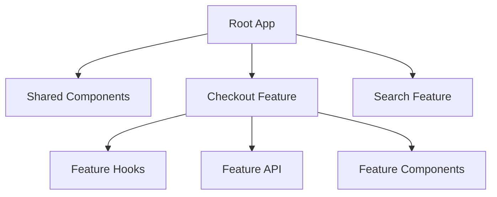

# Deep Answer

### Interview Answer (Aise bolna hai):
Dekho, honestly bolun to jab app chhoti hoti hai tab structure ka zyada farak nahi padta. Ek do developers hote hain, aur kaam chal jaata hai. Problem tab aati hai jab team badhti hai — 5–6 developers, parallel features, tight deadlines. Maine ye phase dekha hai jahan ek flat components folder itna bada ho gaya ki kisi ko samajh hi nahi aata tha kaunsa component kahan use ho raha hai.

Uske baad maine feature-based approach follow karna start kiya. Matlab har feature — jaise checkout, search, profile — apna ek clear boundary rakhta hai. Uske andar hi uske components, hooks aur API logic hote hain.

Isse mujhe do major benefits mile. Pehla, agar checkout me bug aata hai to mujhe pata hota hai exactly kahan dekhna hai. Dusra, naye developer ko onboard karna easy ho jaata hai, kyunki feature ownership clear hoti hai.

Shared components jaise buttons ya modals main alag rakhta hoon, par ek cheez jo maine seekhi hai — unko over-generic banana long term me problem create karta hai. Isliye shared layer sirf basic UI deta hai, business logic hamesha feature ke paas hi rehta hai.

### Mental Model

